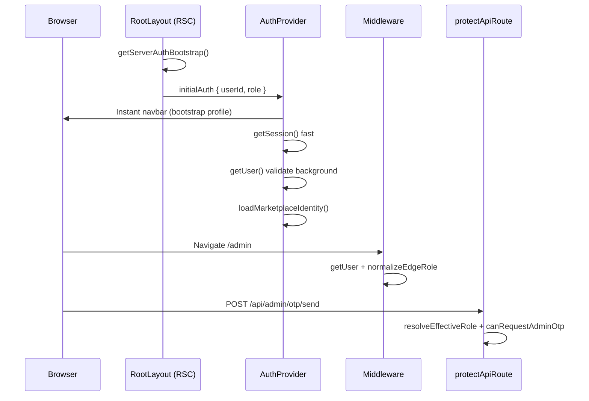

# MetalHub Auth & Performance — System Audit & Fix Log

## 1. Root cause analysis

### Issue 1 — Slow initial load / late navbar

| Cause | Mechanism |
|-------|-----------|
| Client-only identity | Root layout had no server auth snapshot; navbar waited for client `getUser()` + 4 Supabase queries |
| Duplicate auth I/O | `getUser()` + `getSession()` on every hydrate; repeated on `TOKEN_REFRESHED` |
| Full identity reload on token refresh | `onAuthStateChange` set `loading=true` and refetched seller/buyer/company/profile |
| Middleware `getUser()` | Every matched route pays edge auth round-trip before HTML |
| No optimistic UI | Header blocked on `authLoading \|\| roleLoading` |

### Issue 2 — Navbar blank / flicker

| Cause | Mechanism |
|-------|-----------|
| `isAuthenticated` from `session` only | `user` from `getUser()` could lag behind session |
| Global loading gate | Entire auth chrome hidden during `roleLoading` |
| Hydration mismatch risk | Server HTML guest, client later authed without bootstrap |

### Issue 3 — Super Admin 403 on `/api/admin/otp/send`

| Cause | Mechanism |
|-------|-----------|
| **Role alias mismatch** | DB enum `app_role` uses `superadmin`; OTP route checked `role === 'super_admin'` only |
| JWT vs profile split | Middleware uses metadata; OTP uses `profiles.role` raw string |
| No central normalizer | Each layer implemented its own role checks |

## 2. Architecture flaws (before fix)

- **Dual role systems**: `AppRole` (4 values) vs `MarketplaceRole` (15+) vs middleware inlined sets
- **Split 2FA**: `admin_verified` cookie (pages) vs `admin_sessions` table (API `requireAdmin2FA`)
- **Three auth clients**: middleware SSR, server RSC (no cookie write), browser singleton
- **Scattered RBAC**: OTP routes bypassed `protectApiRoute`; permissions used raw `profile.role`

## 3. Security risks

- Middleware RBAC from JWT metadata only (spoofable if metadata out of sync with `profiles`)
- Inconsistent super-admin bypass (`hasPermission` missed `superadmin` alias)
- OTP route `setAll: () => {}` — session cookies not refreshed on that handler (stale session edge cases)

## 4. Performance bottlenecks

1. AuthProvider 4-table parallel fetch on every sign-in/refresh  
2. Header full skeleton on `roleLoading`  
3. Middleware on 12+ route prefixes  
4. `platform_settings` fetch on every auth hydrate  

## 5–6. Fix plan & files changed

### New modules

| File | Purpose |
|------|---------|
| `lib/auth/rbac.ts` | Canonical role normalization, admin/OTP checks |
| `lib/auth/bootstrap-server-auth.ts` | SSR auth snapshot for layout |
| `lib/auth/auth-logger.ts` | Structured diagnostics (`AUTH_DEBUG=true`) |
| `supabase/migrations/202605200003_role_normalization.sql` | DB `superadmin` → `super_admin` |

### Updated

| File | Change |
|------|--------|
| `lib/auth/protect-route.ts` | Normalized roles, super_admin bypass |
| `lib/auth/permissions.ts` | `isSuperAdminRole()` for bypass |
| `lib/auth/profile-role.ts` | Delegates to `rbac` |
| `app/api/admin/otp/send|verify` | `canRequestAdminOtp()` |
| `middleware.ts` | `superadmin` alias in sets |
| `components/auth/AuthProvider.tsx` | SSR bootstrap, fast session path, no reload on `TOKEN_REFRESHED` |
| `app/layout.tsx` | Async server bootstrap |
| `components/layout/header.tsx` | Optimistic guest/authed chrome |
| `lib/supabase/server-client.ts` | `validateUserRole` uses rbac |

## 7. Database fixes

Run:

```bash
supabase db push
```

Migration `202605200003_role_normalization.sql` aligns `profiles.role` and auth metadata to `super_admin`.

## 10. Auth flow (after fix)



## 11. Target architecture

- **Authoritative role**: `profiles.role` (normalized at every boundary)
- **SSR bootstrap**: One lightweight profile read in root layout
- **Client hydrate**: Session-first, identity second, silent token refresh
- **RBAC**: `lib/auth/rbac.ts` only — no raw string compares in routes
- **Super admin**: Always bypasses role lists + permission matrix (not 2FA unless `requireAdmin2FA`)

## Operations

- Enable debug logs: `AUTH_DEBUG=true`
- Verify super admin: `profiles.role` should be `super_admin` (not `superadmin`) after migration
- Re-test: login → `/admin/verify` → OTP send → should return 200
