# Custom Tolerance Platform Synchronization Audit

Date: 2026-07-09
Status: Architecture audit and implementation package

## Executive Summary

The platform is currently operating as a hybrid system rather than a unified marketplace ecosystem. The codebase contains:

The architectural target is now explicit: business logic must be executed exclusively through a shared domain service layer. API routes, helper modules, and UI actions should no longer perform direct business mutations or coordinate cross-module side effects on their own.

- Next.js application routes under the app tree
- Supabase-based server data access in routes such as [app/api/quotes/route.ts](app/api/quotes/route.ts), [app/api/ops/verification/[id]/route.ts](app/api/ops/verification/[id]/route.ts), and [app/api/admin/dashboard/route.ts](app/api/admin/dashboard/route.ts)
- A Prisma schema in [prisma/schema.prisma](prisma/schema.prisma) that defines a different canonical data model
- Shared helper modules in [lib/marketplace/notifications.ts](lib/marketplace/notifications.ts), [lib/marketplace/messaging.ts](lib/marketplace/messaging.ts), and [lib/marketplace/audit-events.ts](lib/marketplace/audit-events.ts) that are not yet wired into a single event-driven system

This creates a critical architecture issue: there is no single source of truth for users, company records, listings, RFQs, notifications, permissions, analytics, or CRM state. The result is duplicated logic, inconsistent state, and non-synchronized workflows.

## 1. Complete System Dependency Graph

### Core dependency map

The intended execution path is:

```text
UI -> API Route / Server Action -> Domain Service Layer -> Repository Layer -> Database Transaction -> Outbox Event -> Background Workers -> Subscribers
```

No business logic should run outside the domain service layer.

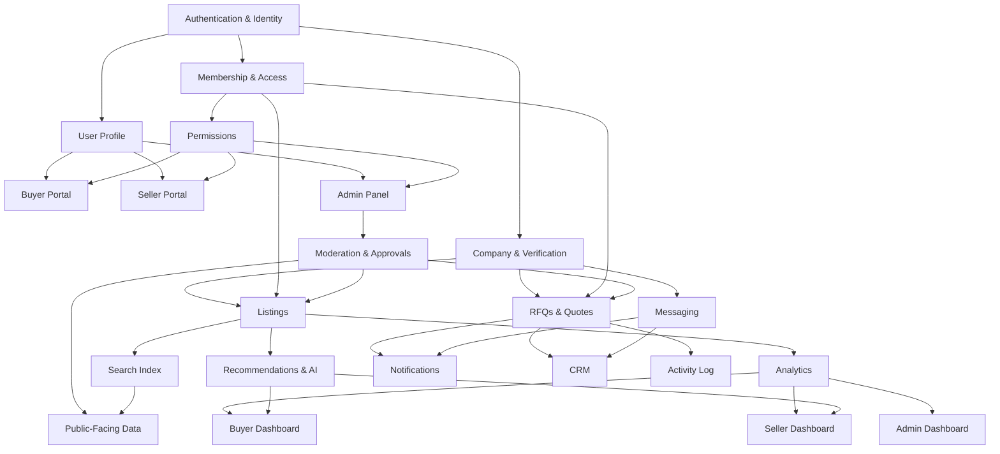

### Module-to-module relationships

- Presentation layer → Domain services only
- Domain services → Repositories and event emission only
- Authentication → Profile, Company, Membership, Permissions, Audit Logs
- Buyer actions → RFQ creation, inquiry creation, shortlist actions, message threads, notifications, CRM, analytics, AI recommendations
- Seller actions → Listing lifecycle, catalog uploads, verification updates, quote responses, inbox updates, analytics, search relevance
- Admin actions → moderation, approvals, suspensions, feature flags, company verification, reporting, audit logging
- Listings → Search, recommendations, buyer discovery, seller dashboards, analytics, public profile
- RFQs/Quotes → Messaging, notifications, CRM, dashboards, AI opportunity matching
- Membership → feature unlocks, permissions, analytics, search prominence, billing lifecycle
- Files/Uploads → verification profile state, admin review, permissions, public visibility
- Activity Log → every domain event, admin audit, and compliance trail

## 2. End-to-End Entity Lifecycle Diagrams

### Buyer lifecycle

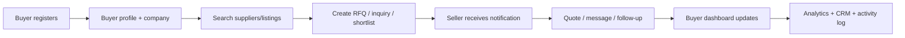

### Seller lifecycle

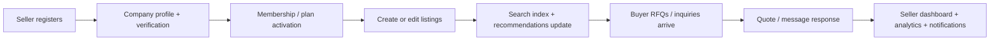

### Admin lifecycle

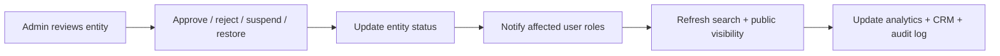

### RFQ lifecycle

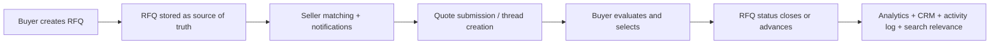

### Listing lifecycle

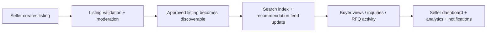

### Company lifecycle

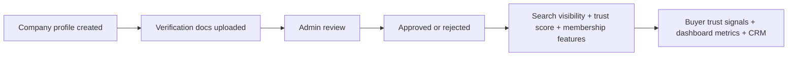

### Membership lifecycle

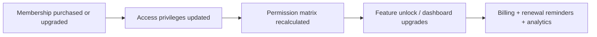

### Notification lifecycle

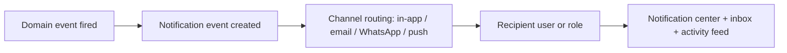

### CRM lifecycle

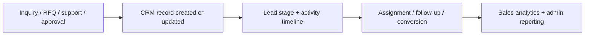

### AI lifecycle

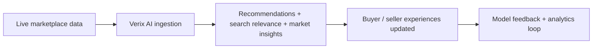

### Analytics lifecycle

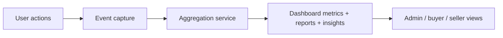

## 3. Database Relationship Audit and Recommended Schema Improvements

### Current observations

1. The Prisma schema in [prisma/schema.prisma](prisma/schema.prisma) defines a strong base model for users, profiles, memberships, listings, chats, payments, admin logs, notifications, suppliers, capabilities, inquiries, CRM leads, and audit logs.
2. The runtime API routes in [app/api/quotes/route.ts](app/api/quotes/route.ts), [app/api/ops/verification/[id]/route.ts](app/api/ops/verification/[id]/route.ts), [app/api/admin/dashboard/route.ts](app/api/admin/dashboard/route.ts), and [lib/marketplace/messaging.ts](lib/marketplace/messaging.ts) are operating against Supabase tables such as `buyer_profiles`, `seller_profiles`, `companies`, `rfqs`, `quotes`, `message_threads`, `notifications`, and `admin_audit_logs`.
3. The system is therefore split across two data layers instead of using one authoritative schema.

### Primary database issues

- No single source of truth for users and companies
- No canonical relation between `User`, `Profile`, `Supplier`, `Buyer`, `Seller`, and `Company`
- RFQs, quotes, message threads, and notifications are not represented in the Prisma schema as first-class synchronized entities
- Missing transactional boundaries for multi-step workflows such as quote submission, verification approval, and listing moderation
- No idempotency keys for retries and duplicate event handling
- No unified event ledger or outbox pattern for cross-module updates

### Recommended schema improvements

- Make Prisma the canonical schema for all transactional business data
- Keep repositories as the only database access abstraction used by domain services
- Introduce or align the following domain models:
  - `User` → canonical identity record
  - `Profile` → buyer/seller profile payload
  - `Company` → one company per profile or seller entity
  - `VerificationDocument` → documents, status, reviewer metadata
  - `Membership` → subscription and access state
  - `Listing` → catalog state and moderation status
  - `Rfq` → buyer requirement source of truth
  - `Quote` → seller response and status transition
  - `MessageThread` and `Message` → procurement conversations
  - `Notification` → actionable in-app notifications
  - `ActivityEvent` / `AuditEvent` → unified audit trail
  - `AnalyticEvent` → event-based metrics ingestion
- Enforce the following relationships:
  - `User` 1:1 `Profile`
  - `Company` 1:N `Users` or 1:1 `SellerProfile`
  - `Listing` N:1 `Company`
  - `Rfq` N:1 `Company`
  - `Quote` N:1 `Rfq` and N:1 `Listing`
  - `Notification` N:1 `User`
  - `AuditEvent` N:1 `User`
- Add the following safeguards:
  - foreign keys on all relations
  - `ON DELETE CASCADE` for dependent events and user-owned records
  - unique constraints on `userId + companyId` and `rfqId + sellerId` combinations where appropriate
  - indexes on `status`, `createdAt`, `userId`, `companyId`, `sellerId`, `category`, `location`, and search-friendly arrays
  - explicit `NOT NULL` constraints on critical lifecycle fields

## 4. Event-Driven Architecture Map

### Recommended event model

Use a single domain-event pipeline with an outbox table and background workers rather than direct module-to-module calls. Every important mutation must originate in a domain service and be committed atomically with a corresponding outbox event.

### Domain events and subscribers

| Event | Publisher | Subscribers |
| --- | --- | --- |
| `buyer.rfq.created` | RFQ service | notifications, seller inbox, analytics, CRM, activity log, search relevance |
| `seller.listing.created` | Listing service | search index, recommendations, buyer discovery, analytics, public profile |
| `seller.listing.updated` | Listing service | search index, recommendation model, dashboards, notifications |
| `seller.listing.deleted` | Listing service | search index, buyer caches, analytics, admin moderation |
| `seller.quote.submitted` | Quote service | buyer notification, messaging thread, CRM, analytics, activity log |
| `admin.verification.approved` | Verification service | company trust status, seller dashboard, buyer discovery, notifications |
| `admin.verification.rejected` | Verification service | seller dashboard, notifications, audit log |
| `company.suspended` | Admin moderation service | auth disablement, listings hide, RFQ block, messaging disablement, analytics |
| `membership.changed` | Billing / membership service | permissions, feature flags, dashboards, analytics |
| `message.sent` | Messaging service | inbox, notifications, CRM, activity log |
| `file.uploaded` | Upload service | verification review, profile state, storage permissions, audit log |
| `analytics.event.collected` | Event ingestion | dashboards, reports, AI training feedback |

### Implementation pattern

- Write each domain mutation to the transactional store first
- Emit an event into an outbox table in the same transaction
- A background worker consumes the outbox and dispatches to subscribers
- Each subscriber should be idempotent and replay-safe
- If the transaction rolls back, no business record and no outbox event should persist

## 5. API Inventory, Gaps, and Redundancy Audit

### Current route families present

The app currently contains route families under the app/api tree for admin, auth, banners, buyers, capabilities, crm, dashboard, inquiries, listings, marketplace, notifications, ops, otp, payment, products, profile, quotes, rfq, settings, supplier, suppliers, uploads, and v2.

### High-risk API findings

- [app/api/quotes/route.ts](app/api/quotes/route.ts) creates a quote, creates or updates a procurement thread, and sends notifications, but it does not wrap the workflow in a transaction and does not trigger a full synchronization event set.
- [app/api/ops/verification/[id]/route.ts](app/api/ops/verification/[id]/route.ts) updates a verification document and company status, but it does not propagate to search, supplier ranking, analytics, or the broader company profile lifecycle.
- [app/api/admin/dashboard/route.ts](app/api/admin/dashboard/route.ts) is using dashboard metrics that depend on tables and fields that do not align with the Prisma schema, which indicates schema drift and a likely production reliability issue.
- [lib/marketplace/messaging.ts](lib/marketplace/messaging.ts) uses message thread tables that are separate from the Prisma chat model, which creates a split conversation system.
- [lib/marketplace/notifications.ts](lib/marketplace/notifications.ts) defines notifications as lightweight helper payloads rather than a canonical persisted notification workflow.

### API audit recommendations

- Consolidate all write APIs behind shared service functions instead of inline route logic
- Require every mutation to call a domain service and then emit a domain event
- Prohibit direct database writes from routes, helpers, and UI actions
- Standardize response shape to `{ success, data, meta, errors }`
- Add validation at the service layer, not only in the route handler
- Require transaction boundaries for multi-step actions such as quote creation, verification approval, membership upgrade, and listing moderation

## 6. Synchronization Matrix

| User action | Buyer | Seller | Admin | Notifications | CRM | Search | AI | Analytics |
| --- | --- | --- | --- | --- | --- | --- | --- | --- |
| Buyer creates RFQ | updated | notified | visible | created | created | reindex | matched | updated |
| Seller submits quote | updated | updated | visible | created | updated | linked | matched | updated |
| Buyer shortlist supplier | updated | notified | visible | created | updated | no-op | retrain signal | updated |
| Buyer submits inquiry | updated | notified | visible | created | updated | no-op | matched | updated |
| Seller creates listing | updated | updated | visible | optional | linked | reindex | re-rank | updated |
| Seller edits listing | updated | updated | visible | optional | linked | reindex | re-rank | updated |
| Seller uploads certificate | updated | updated | visible | created | updated | reindex | trust update | updated |
| Admin approves seller | updated | updated | updated | created | updated | reindex | trust update | updated |
| Admin rejects listing | updated | updated | updated | created | updated | reindex | re-rank | updated |
| Admin suspends company | updated | updated | updated | created | updated | hide / reindex | downrank | updated |
| Membership changes | updated | updated | visible | created | linked | reindex | feature signal | updated |
| File upload completes | updated | updated | visible | optional | updated | no-op | no-op | updated |

## 7. Permission and Role Architecture Audit

### Current state

The project already has a centralized middleware utility in [lib/auth/protect-route.ts](lib/auth/protect-route.ts), which is a strong base for RBAC enforcement.

### Gaps

- Role resolution is split across Supabase auth metadata and the profile data model
- The Prisma schema uses a `User` role model, while the runtime routes reference different role-bearing tables and concepts
- Permission logic is not yet consistently enforced across all domain services

### Recommended architecture

- Treat authorization as a shared service layer, not as route-level logic
- Define a single canonical permission matrix with roles such as `BUYER`, `SELLER`, `ADMIN`, `MODERATOR`, `SUPPORT`, and `DEVELOPER`
- Enforce permissions in a domain service before each write operation
- Require every important action to be checked by both role and resource ownership rules
- Keep permission enforcement inside the domain service boundary so API layers cannot bypass business rules

## 8. Caching and Invalidation Strategy

### Current gap

There is no unified cache invalidation strategy across dashboards, search, recommendations, public profile pages, and admin views.

### Recommended strategy

- Use a short-lived cache for read-heavy content such as listings and public supplier profiles
- Invalidate the relevant cache entries on every domain event that changes the underlying entity
- For search: invalidate or refresh relevant index entries immediately after listing, company, or verification changes
- For dashboards: recompute or refresh server-rendered metrics after each relevant mutation
- For client-side state: clear or refetch the relevant query keys after write operations

### Recommended cache keys

- `listing:{id}`
- `company:{id}`
- `seller-dashboard:{userId}`
- `buyer-dashboard:{userId}`
- `admin-dashboard:{scope}`
- `search:{query}:{filters}`
- `recommendations:{userId}`

## 9. Background Job and Queue Architecture

### Recommended queue design

- Use a durable outbox + queue worker pattern for asynchronous work
- Separate workers by responsibility: notification, email, WhatsApp, search, analytics, CRM, AI, recommendation, and audit
- Background workers should handle:
  - email delivery
  - WhatsApp delivery
  - search reindexing
  - analytics event ingestion
  - AI processing and recommendation refresh
  - notification fan-out
  - CRM sync and lead assignment

### Processing model

1. Transaction commits
2. Outbox row is written
3. Worker picks up event
4. Subscriber actions are retried safely
5. Failure is recorded with retry metadata and dead-letter handling

## 10. Frontend Integration Audit

### Problems identified

- [app/dashboard/analytics/page.tsx](app/dashboard/analytics/page.tsx) is still a placeholder page rather than a live analytics surface
- [app/ops/admin/page.tsx](app/ops/admin/page.tsx) contains hard-coded administrative KPI values instead of fully wired live metrics
- Several dashboard surfaces are likely to be disconnected from the same backend source of truth if the underlying route contracts remain inconsistent
- Important UI actions such as approvals, moderation decisions, and company suspension need to trigger the same domain services that power the backend rather than isolated UI-only state changes

### Frontend requirements for the synchronized version

- Every dashboard card should read from a shared metrics service
- Every form should call the same canonical backend service as the API used elsewhere
- Every action should show loading, success, empty, and error states
- Navigation should follow the same role and permission model as the backend

## 11. Production Readiness Checklist

### Buyer

- [ ] RFQ creation updates seller inbox, notifications, analytics, CRM, and activity log
- [ ] Buyer dashboard reflects real counts for RFQs, quotes, messages, bookmarks, shortlist, and activity
- [ ] Buyer-facing search results reflect listing, membership, and verification state in real time

### Seller

- [ ] Listing create/update/delete flows reindex discoverability and update public profile and dashboards
- [ ] Quote responses trigger messaging and buyer notification workflows
- [ ] Seller dashboard shows real metrics for views, inquiries, response rate, and revenue opportunities

### Admin

- [ ] Approval, rejection, suspension, and restoration actions are backed by real backend state transitions
- [ ] Admin dashboard metrics read from the same canonical data source as the rest of the platform
- [ ] Audit logs capture all critical admin changes with actor, target, old value, new value, and timestamp

### Shared platform

- [ ] Single source of truth for users, companies, listings, RFQs, notifications, and analytics
- [ ] All business logic executed through domain services only
- [ ] Repositories are the only abstraction that touches the database
- [ ] Event-driven propagation for all cross-module updates
- [ ] Centralized permissions and validation
- [ ] Idempotent background job handling
- [ ] Live search, recommendations, and AI features backed by synchronized data

## 12. Prioritized Implementation Roadmap

### Phase 1 — Foundation

- Create a shared domain-service layer and make it the only place where business logic may execute
- Add repository classes so only repositories talk to Prisma or the canonical data layer
- Consolidate identity and profile data behind one canonical schema
- Align API routes with the canonical data model
- Centralize permission checks and shared validation
- Introduce an audit event service and standardized response contract

### Phase 2 — Core Synchronization

- Implement domain services for user, company, listing, RFQ, quote, and notification workflows
- Ensure major user actions trigger cross-module updates
- Connect dashboards to live backend metrics
- Replace isolated UI-only state with domain-driven backend mutations
- Remove business logic from API routes, helper modules, and UI actions as the services take over

### Phase 3 — Events and Automation

- Introduce outbox-based event emission
- Implement worker-driven notifications, analytics ingestion, and search reindexing
- Add retry and idempotency handling for asynchronous operations
- Connect CRM and activity log to the same event pipeline
- Add idempotency tables and correlation IDs for every event and worker execution

### Phase 4 — Analytics and AI

- Feed live platform activity into analytics and reporting
- Connect recommendations and AI surfaces to the synchronized data layer
- Create real-time and scheduled insight views for buyer, seller, and admin roles

### Phase 5 — Final QA and Production Hardening

- Run end-to-end regression tests across buyer, seller, admin, notifications, and search flows
- Validate permissions, audit trails, and cache invalidation
- Verify production readiness for scaling, observability, and resilience
- Confirm that all critical mutations are executed through the domain-service boundary and that no direct business writes remain outside it

## Recommended Architectural Direction

The platform should evolve into a single, event-driven marketplace platform where each business action is handled once, persisted once, and propagated automatically to all dependent systems. The target architecture is:

- one canonical database schema
- one shared domain service layer that is the only permitted place for business logic
- one repository layer that is the only permitted place for database access
- one event bus and outbox pattern
- one permission engine
- one analytics ingestion pipeline
- one notification and CRM integration layer

That is the only path to a fully synchronized buyer, seller, admin, search, analytics, CRM, notifications, and AI ecosystem.
